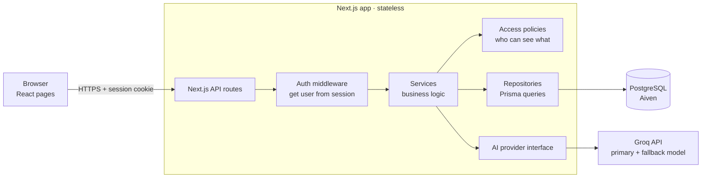
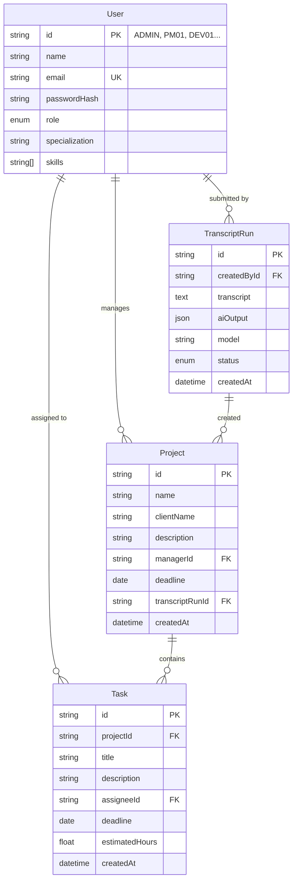

# Architecture

**AI Project Manager: Meeting to Execution** · The Infinity Hack '26

The goal is an app that is **simple enough to build in 3 hours** but **structured so it can grow** into a real multi-team product without a rewrite.

**Approach:** a **modular monolith**. There is one Next.js app and one database, but the code is split into clear modules and layers. Any module can later be moved into its own service without changing the others.

---

## 1. High-Level Overview



| Layer | Responsibility | Rule |
|---|---|---|
| **Pages / components** | UI only | Never talk to the database or AI directly |
| **API routes** | HTTP in/out, status codes | Thin: parse request → call service → return JSON |
| **Middleware / session** | Identify the current user | User comes from the session cookie only, never from the request body |
| **Services** | Business logic (create from transcript, list projects) | No HTTP or framework code, so they are easy to test and reuse |
| **Policies** | Role-based access rules | All "who can see what" logic lives in one place |
| **Repositories** | Database queries | The only layer that imports Prisma |
| **AI provider** | Call the LLM | Behind an interface, so Groq can be swapped for any provider |

---

## 2. Folder Structure

```
src/
├── app/                          # Next.js routes (UI + API)
│   ├── (auth)/login/page.tsx
│   ├── (dashboard)/
│   │   ├── layout.tsx            # navbar, role-aware menu
│   │   ├── page.tsx              # redirects by role
│   │   ├── projects/page.tsx
│   │   ├── projects/[id]/page.tsx
│   │   ├── my-tasks/page.tsx
│   │   ├── team/page.tsx
│   │   └── transcript/page.tsx   # admin only
│   └── api/
│       ├── auth/login/route.ts
│       ├── auth/logout/route.ts
│       ├── auth/me/route.ts
│       ├── users/route.ts
│       ├── projects/route.ts
│       ├── projects/[id]/route.ts
│       ├── tasks/mine/route.ts
│       └── transcript/route.ts
│
├── modules/                      # one folder per business domain
│   ├── auth/
│   │   ├── session.ts            # sign/verify JWT cookie, getCurrentUser()
│   │   └── auth.service.ts       # login(email, password)
│   ├── users/
│   │   ├── user.repo.ts
│   │   └── user.service.ts       # directory for UI + AI
│   ├── projects/
│   │   ├── project.repo.ts
│   │   ├── project.service.ts
│   │   └── project.policy.ts     # canViewProject, projectFilterFor(user)
│   ├── tasks/
│   │   ├── task.repo.ts
│   │   ├── task.service.ts
│   │   └── task.policy.ts        # taskFilterFor(user, projectId)
│   └── transcript/
│       ├── transcript.service.ts # orchestrates: AI → validate → save
│       ├── transcript.prompt.ts  # system prompt + message builder
│       ├── transcript.schema.ts  # zod schema for AI output
│       └── transcript.validate.ts# business checks (roles, dates)
│
├── lib/                          # shared infrastructure
│   ├── ai/
│   │   ├── provider.ts           # interface AIProvider { completeJSON() }
│   │   ├── groq.ts               # Groq implementation
│   │   └── index.ts              # picks provider + fallback from env
│   ├── db.ts                     # single Prisma client
│   ├── env.ts                    # validates env vars at startup (zod)
│   ├── errors.ts                 # AppError, NotFound, Forbidden, ValidationError
│   └── http.ts                   # withHandler(): auth + error → JSON response
│
├── components/                   # reusable UI (ProjectCard, TaskTable, ...)
└── types/                        # shared TypeScript types (API contract)

prisma/
├── schema.prisma
├── migrations/
└── seed.ts                       # idempotent upsert of 10 demo users
```

**Why modules?** Each domain (projects, tasks, transcript) owns its repository, service and policy. A new feature such as comments or time tracking becomes a new folder and does not change existing code.

---

## 3. Key Design Decisions

### 3.1 Access control in one place
```ts
// modules/projects/project.policy.ts
export function projectFilterFor(user: CurrentUser): Prisma.ProjectWhereInput {
  switch (user.role) {
    case "ADMIN":   return {};
    case "MANAGER": return { managerId: user.id };
    case "AGENT":   return { tasks: { some: { assigneeId: user.id } } };
  }
}
// modules/tasks/task.policy.ts
export function taskFilterFor(user: CurrentUser, projectId: string): Prisma.TaskWhereInput {
  return user.role === "AGENT" ? { projectId, assigneeId: user.id } : { projectId };
}
```
Every query goes through these filters, so a new endpoint cannot accidentally leak data. Opening a project outside your filter returns `403`.

### 3.2 AI behind an interface
```ts
// lib/ai/provider.ts
export interface AIProvider {
  completeJSON(messages: ChatMessage[], opts?: { model?: string }): Promise<unknown>;
}
```
- `groq.ts` implements it today.
- A fallback model is tried automatically if the primary fails or rate-limits.
- Switching to OpenAI, Claude, or a self-hosted model means adding one file. The transcript service doesn't change.

### 3.3 Transcript pipeline (single responsibility per step)
```
transcript.service.createFromTranscript(user, text)
  1. assertAdmin(user)                     → policy
  2. directory = userService.directory()   → no passwords
  3. raw = ai.completeJSON(prompt(text, directory))
  4. draft = transcriptSchema.parse(raw)   → shape check (zod)
  5. issues = validateBusiness(draft, directory) → roles, dates, hours
  6. if issues → throw ValidationError(issues)   (nothing saved)
  7. prisma.$transaction(create projects + tasks) → all-or-nothing
  8. save TranscriptRun record (audit)
```

### 3.4 Stateless app
- The session is a signed JWT in an httpOnly cookie. Nothing is stored in server memory.
- Any number of app instances can run behind a load balancer. Vercel does this automatically.

### 3.5 Consistent errors
`withHandler()` wraps every API route. It maps `AppError` subclasses to `400 / 401 / 403 / 404`, logs unexpected errors and returns `500` with a safe message. The UI always receives `{ error, issues? }`.

### 3.6 Config validated at startup
`lib/env.ts` checks `DATABASE_URL`, `GROQ_API_KEY`, `GROQ_MODEL`, `GROQ_FALLBACK_MODEL` and `SESSION_SECRET` with zod. A missing variable stops the app at boot instead of failing in the middle of a demo.

---

## 4. Data Model



- **Indexes:** `Project.managerId`, `Task.projectId`, `Task.assigneeId`. These cover every role-filtered query.
- **`TranscriptRun`** (optional, cheap to add): stores the raw transcript and AI output. It is useful for debugging, auditing and re-running, and later for showing a history of past meetings.
- **Cascade delete** from Project to Task, so the reset script stays simple.

---

## 5. Request Flow Examples

**Agent opens a project**
```
GET /api/projects/abc  →  withHandler → getCurrentUser (cookie)
  → projectService.getById(user, "abc")
      → project.repo.findFirst({ id: "abc", ...projectFilterFor(user) })  → null? → 403
      → task.repo.findMany(taskFilterFor(user, "abc"))                    → only own tasks
  → 200 { project, tasks }
```

**Admin creates from transcript**
```
POST /api/transcript  →  withHandler → getCurrentUser → transcriptService.createFromTranscript
  → 201 { projects, taskCount }   or   400 { error, issues[] }   or   403
```

---

## 6. Scaling Roadmap

The structure above does not need to change for any of these steps. Each one adds to it.

| Stage | Trigger | Change |
|---|---|---|
| **0 · Hackathon** | Now | Single Next.js app on Vercel, Aiven Postgres, Groq |
| **1 · Real team usage** | Hundreds of users | Connection pooling (PgBouncer / Prisma Accelerate); pagination on lists; edit/approve AI draft before save; task status |
| **2 · Long transcripts / many requests** | AI calls slow or rate-limited | Move AI to a **background job queue** (e.g. BullMQ + Redis or Inngest): `POST /transcript` returns a `runId`, UI polls or listens over WebSocket. Retries and fallback live in the worker |
| **3 · Multiple companies (SaaS)** | More than one customer | Add `organizationId` to every table; policies add `orgId = user.orgId` (one change, since all filtering is in policies); per-org AI keys and usage limits |
| **4 · Heavy load** | Thousands of orgs | Read replicas for list queries; Redis cache for directory/project lists; split `transcript` module into its own service (it already has a clean interface); observability (OpenTelemetry, Sentry) |
| **5 · New input sources** | Product growth | Audio upload → speech-to-text → same transcript pipeline; integrations (Slack, Jira, Google Meet) as new modules that call `transcriptService` |

---

## 7. Security Checklist

- [x] Passwords hashed with bcrypt; never returned by the API and never sent to the AI
- [x] Current user taken only from the signed session cookie
- [x] Role filters applied in database queries, not only in the UI
- [x] Admin-only check on transcript creation, done on the server
- [x] AI output treated as untrusted: shape and business validation before saving
- [x] Secrets only in server-side env vars (never `NEXT_PUBLIC_*`); `.env.example` with placeholders
- [x] Transcript size limit (for example 50 KB) to keep AI cost and abuse in check

---

## 8. Tech Stack

| Concern | Choice | Why |
|---|---|---|
| Framework | Next.js (App Router, TypeScript) | UI and API in one deploy, which is fastest to build |
| Database | PostgreSQL on Aiven | Free hosted tier, relational data, scales with replicas |
| ORM | Prisma | Typed queries, migrations, transactions |
| Validation | zod | One schema library for API input, AI output and env vars |
| Auth | JWT in httpOnly cookie (`jose`) + bcrypt | Stateless, so the app scales horizontally |
| AI | Groq (Llama 3.3 70B) behind `AIProvider` | Fast, free tier, JSON mode, swappable |
| UI | Tailwind CSS (+ shadcn/ui optional) | Fast to build a clean UI |
| Hosting | Vercel | Zero-config Next.js, auto-scaling |
